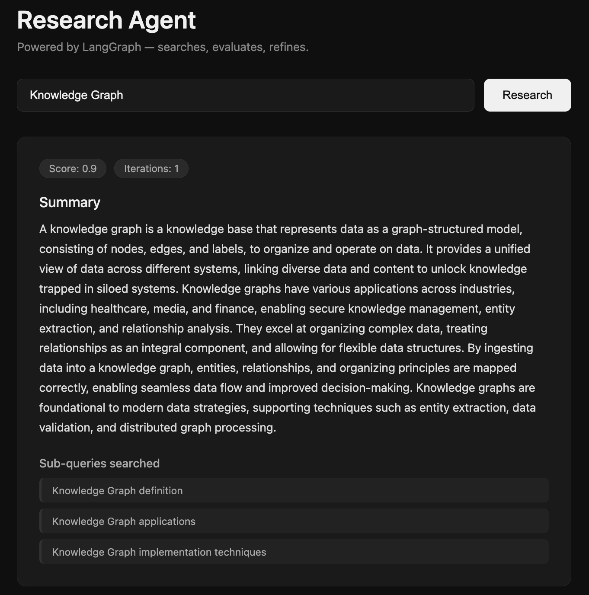

# Multistep Research Agent

> Give it a topic. It researches, evaluates, and refines until the answer is good enough.

A full-stack agentic pipeline built with LangGraph + FastAPI + React. Takes a user topic, breaks it into sub-queries, fetches from multiple sources in parallel, evaluates output quality, and iteratively refines until a quality threshold is met — using all 4 core agentic workflow patterns.

**Live Demo:** [multistep-research-agent.vercel.app](https://multistep-research-agent.vercel.app)
**API Docs:** [multistep-research-agent-production.up.railway.app/docs](https://multistep-research-agent-production.up.railway.app/docs)

---

## Demo



```
Input:  "Knowledge Graph"

→ Planner    generates 3 focused sub-queries
→ Fetcher    searches all 3 in parallel via Tavily
→ Evaluator  scores output quality (0.9 — passed first try)
→ Output     clean research summary, 1 iteration
```

---

## Architecture

```
START → planner → [fetcher × N] → evaluator → END
                                       ↑          ↓
                                    refiner ←  score < 0.8
```

| Pattern | Where used | LangGraph mechanism |
|---|---|---|
| Sequential | planner → fetcher → evaluator → refiner | `add_edge` |
| Parallel | fetch N sources simultaneously | `Send()` API |
| Conditional | good enough or refine? | `add_conditional_edges` |
| Iterative | loop until threshold met | cycle back to evaluator |

---

## Tech Stack

**Backend**
- LangGraph — agentic graph orchestration
- LangChain + Groq — LLM calls (llama-3.3-70b-versatile, free tier)
- Tavily — web search API (free tier)
- FastAPI + Uvicorn — REST API server
- Python 3.12

**Frontend**
- React + Vite
- Axios — API calls

**Infrastructure**
- Docker + Docker Compose — containerisation and local orchestration
- Railway — backend deployment
- Vercel — frontend deployment
- nginx — static file serving + API proxy

---

## Project Structure

```
multistep-research-agent/
├── docker-compose.yml
├── README.md
├── demo.png
├── backend/
│   ├── Dockerfile
│   ├── requirements.txt
│   ├── state.py          # shared TypedDict state
│   ├── graph.py          # LangGraph graph wiring
│   ├── api.py            # FastAPI server
│   ├── main.py           # local test entry point
│   └── nodes/
│       ├── planner.py    # LLM breaks topic into sub-queries
│       ├── fetcher.py    # Tavily web search (parallel)
│       ├── evaluator.py  # LLM scores + writes draft output
│       ├── refiner.py    # LLM improves weak output
│       └── router.py     # conditional edge logic
└── client/
    ├── Dockerfile
    ├── nginx.conf
    └── src/
        ├── App.jsx
        ├── index.css
        └── components/
            ├── SearchBar.jsx
            ├── ResultCard.jsx
            └── Loader.jsx
```

---

## Local Setup

### Option 1 — Docker (recommended)

```bash
git clone https://github.com/your-username/multistep-research-agent
cd multistep-research-agent
```

Create `backend/.env`:
```
GROQ_API_KEY=your-groq-key
TAVILY_API_KEY=your-tavily-key
```

```bash
docker-compose up --build
```

- App → `http://localhost:3000`
- API docs → `http://localhost:8000/docs`

### Option 2 — Manual

**Backend:**
```bash
cd backend
python -m venv venv
source venv/bin/activate
pip install -r requirements.txt
uvicorn api:app --reload
```

**Frontend:**
```bash
cd client
npm install
npm run dev
```

Get free API keys:
- Groq: https://console.groq.com
- Tavily: https://tavily.com

---

## API

**POST** `/research`

Request:
```json
{ "topic": "knowledge graphs" }
```

Response:
```json
{
  "topic": "knowledge graphs",
  "output": "A knowledge graph is a knowledge base that represents data...",
  "quality_score": 0.9,
  "iteration_count": 1,
  "steps": [
    "Knowledge Graph definition",
    "Knowledge Graph applications",
    "Knowledge Graph implementation techniques"
  ]
}
```

Swagger UI → `https://multistep-research-agent-production.up.railway.app/docs`

---

## State Schema

Every node reads from and writes to a shared `ResearchState`:

```python
class ResearchState(TypedDict):
    topic: str                                    # user input
    step: str                                     # single query per fetcher worker
    steps: List[str]                              # sub-queries from planner
    results: Annotated[List[str], operator.add]   # merged fetch results
    output: str                                   # current draft answer
    quality_score: float                          # evaluator score 0.0–1.0
    iteration_count: int                          # loop counter
```

---

## Deployment

| Service | Platform | URL |
|---|---|---|
| Frontend | Vercel | multistep-research-agent.vercel.app |
| Backend | Railway | multistep-research-agent-production.up.railway.app |

**Backend (Railway):**
- Deploys from `backend/` directory
- Auto-detects `Dockerfile`
- Environment variables set in Railway dashboard
- Auto-redeploys on every GitHub push

**Frontend (Vercel):**
- Deploys from `client/` directory
- Auto-detects Vite
- `VITE_API_URL` set in Vercel dashboard
- Auto-redeploys on every GitHub push

---

## Design Decisions & Critical Thinking

### Why `Send()` over fixed parallel edges?

Fixed edges (`add_edge("planner", "fetcher_1")` × 3) require knowing the number of branches at build time. The planner dynamically decides how many sub-queries to generate — could be 2, 3, or 5. `Send()` handles this at runtime, spawning exactly as many workers as there are steps. Fixed edges would break if the planner returned 4 queries instead of 3.

### Why `Annotated[List[str], operator.add]` on results?

When 3 fetcher instances run in parallel and each returns `{"results": [content]}`, LangGraph needs to know how to merge them. Without `operator.add`, the last fetcher overwrites the previous two — you lose data silently. The reducer tells LangGraph to append all lists together before passing state to the next node.

### Why nginx as a proxy in Docker?

Inside Docker, containers communicate using service names (`backend:8000`). The browser on the host machine doesn't know about Docker's internal network, so calling `backend:8000` from React fails with `ERR_NAME_NOT_RESOLVED`. nginx sits in the frontend container and proxies `/api/*` requests to the backend container internally — the browser only ever talks to `localhost:3000`.

### What if the Tavily API goes down mid-run?

The current implementation has no retry logic — a failed fetch returns an empty string and the evaluator scores low, triggering the refiner unnecessarily. A production fix would wrap `client.search()` in a try/except with exponential backoff, and skip failed queries gracefully rather than passing empty strings downstream.

### Can a user exploit the iterative loop to run indefinitely?

Yes, if the `iteration_count` check is removed from the router. The hard exit at 3 iterations prevents infinite loops, but a malicious or confusing topic could still consume 3 full LLM + search cycles before exiting. A production fix would add per-request cost tracking and a timeout at the graph level.

### Why does the evaluator write the draft output, not the refiner?

The evaluator produces the first draft as a side effect of scoring — it needs to understand the content to score it, so writing the summary costs no extra LLM call. The refiner then improves this existing draft. If the evaluator only scored and the refiner wrote from scratch each time, you'd pay for an extra LLM call every iteration.

### What would you improve next?

Structured output parsing. Currently `ast.literal_eval()` on the planner and string splitting on the evaluator are fragile — if the LLM adds preamble text, both crash. Replacing these with LangChain's `with_structured_output()` and Pydantic models would make parsing robust and remove the need for prompt engineering around output format.

---

## What I learned

- How LangGraph's `Send()` API enables dynamic parallel dispatch at runtime
- The difference between `add_edge` fan-out (fixed branches) and `Send()` (runtime branches)
- How `Annotated` reducers solve the fan-in merge problem cleanly
- Why state design matters — every node's behaviour depends on getting state right first
- How to design explicit exit conditions for iterative loops in production systems
- How to expose a LangGraph agent as a REST API with FastAPI and consume it from React
- How Docker networking works — container DNS, port mapping, nginx reverse proxy
- How to deploy a full-stack app with separate frontend and backend services

---

## License

MIT